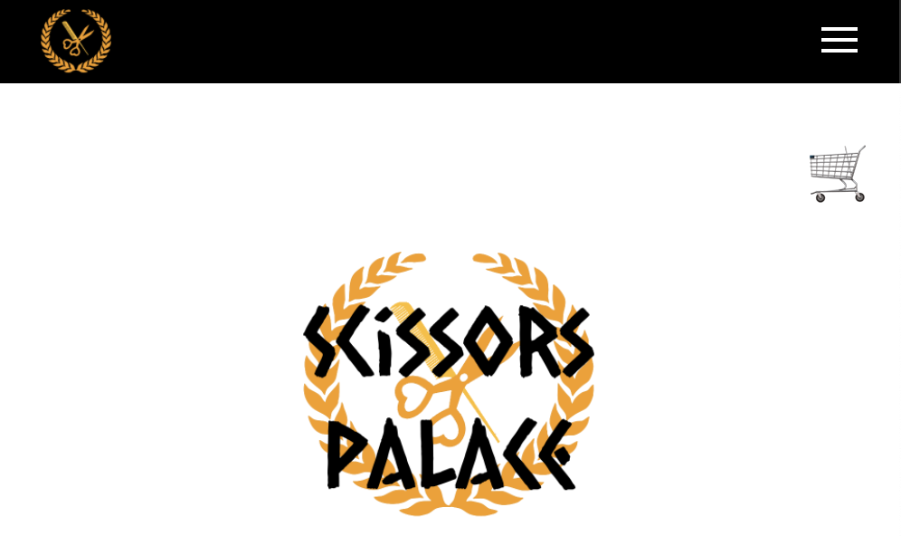

# Scissors Palace

### _A MERN full-stack e-commerce website, featuring Mongoose/MongoDB, Express, React, and Node.js to demo a salon/barbershop website._

---

## Table of Contents
  - [Installation](#installation)
  - [Application](#application)
  - [User-Story](#user-story)
  - [Acceptance-Criteria](#acceptance-criteria)
  - [Features](#features)
  - [Contributors](#contributors)
  - [Project-Member-Legend](#Project-Member-Legend)
  - [License](#license)

---

## Installation

## Application

Currently deployed [on heroku](https://scissors-palace.herokuapp.com/)

  

Technologies include HTML, CSS, Javascript, ReactJS, Tailwind, Node, Redux, MongoDB and GraphQL.

## User Story

    `AS A User searching for an upscale salon 
    I WANT to be able to book appointments online
    SO THAT I can receive the unique services I need`

## Acceptance Criteria

    `GIVEN that a user has accessed the website
    WHEN the user views the homepage
    THEN they are presented with a functional navigation bar or hamburger menu, (mobile).

    GIVEN that a user selects *SHOP*
    WHEN the user chooses *Products*
    THEN the user is presented with an ecommerce markup of salon products

    GIVEN that a user selects a product
    THEN the user will view the product in their shopping cart and have the ability to pay for the product.

    GIVEN that a user selects *SHOP*
    WHEN the user chooses *Services*
    THEN the user is presented with salon services, photos, descriptions and pricing.

    GIVEN that a user selects a service
    THEN the user is presented with a calendar to book the service requested and prompted a confirmation.

    GIVEN that a user selects *ABOUT*
    THEN the user will view all developers and their roles in this project

    GIVEN that a user selects *GALLERY*
    THEN the user will view a history of the salon's premier work

    GIVEN that a user selects *PRESS*
    THEN the user will view news stories published on behalf of the salon

    GIVEN that a user selects *CONTACT*
    WHEN the user fills out the contact form
    THEN an email will be sent to the salon's receptionist and a confirmation promted to user`

## Features

- Single-page application using React components
- Responsive CSS to adapt to mobile devices
- Functioning contact form that sends you e-mails once submitted

---

## Contributors

## Project Member Legend

|ID  |Name  |
|---------|----|
|A     |Erick Flores|
|B     |Jesse Ceniceros|
|C     |Ida Shalilian|
|D     |Celeste Moore|
|E     |Kevin Henley|

---

## License

  

© 2021 _Team Mongoose_

